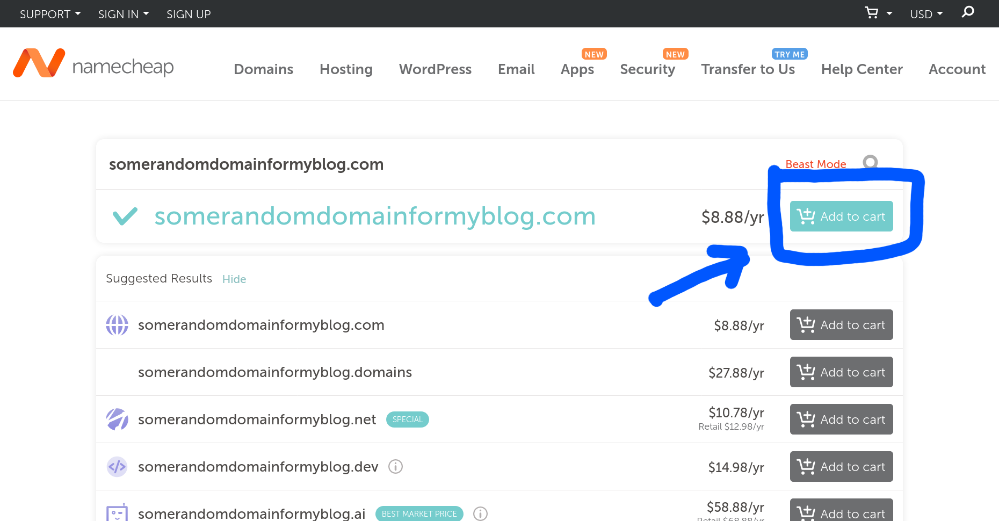
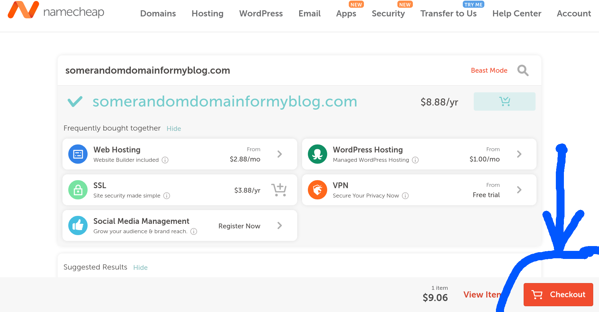
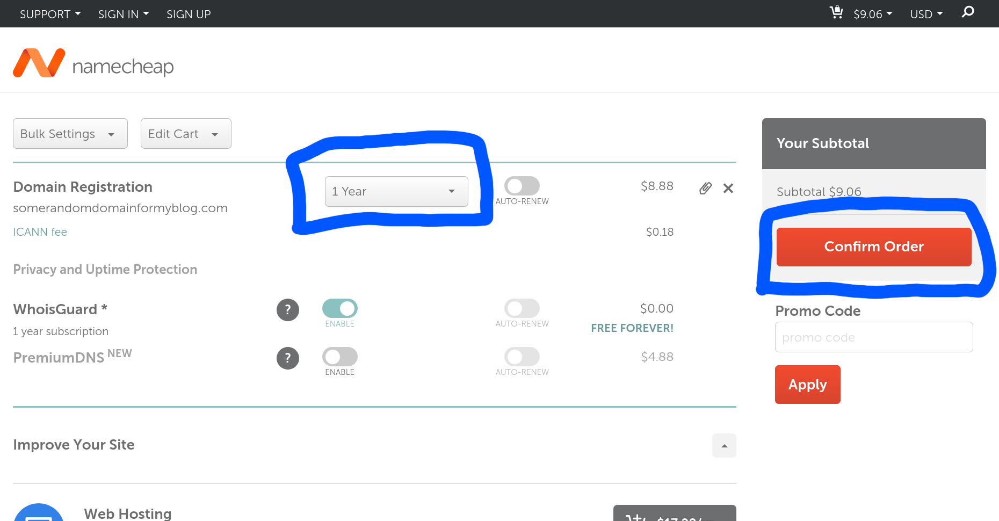
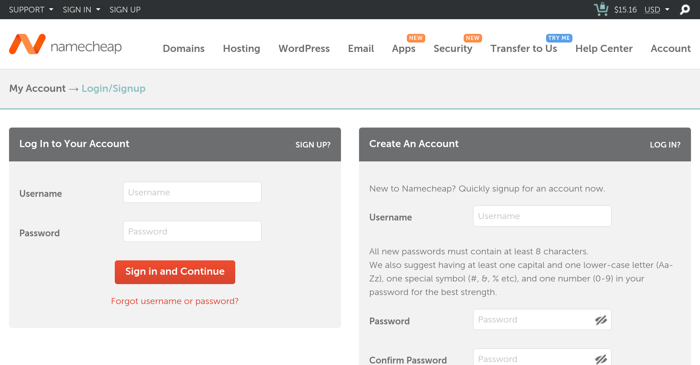
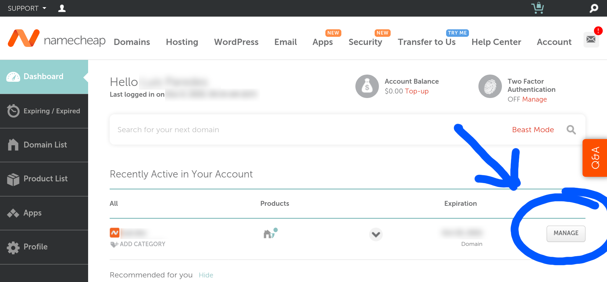
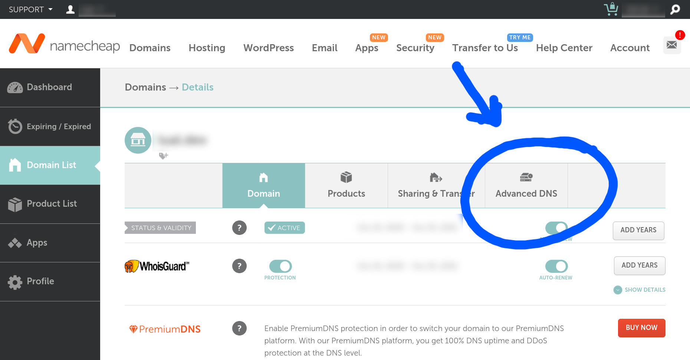
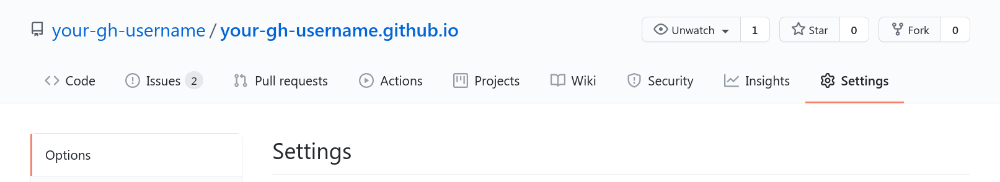
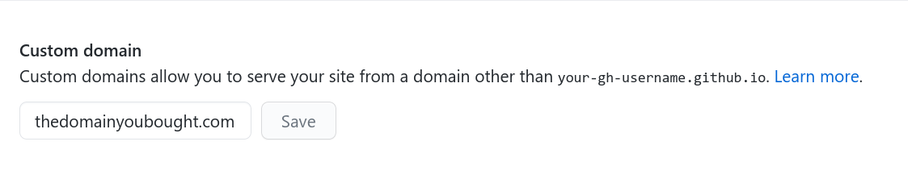

GitHub Pages has become a very handy alternative for free, reliable and secure hosting for brochure sites and blogs. All you need to do to be able to use it is to have a GitHub account and be able to perform a few simple development tasks.

In this post we'll be learning how to use the service to launch a blog with our own custom domain.

## Setting Up the Blog

As with any other type of website we need some HTML, CSS and JavaScript files to be served, and we can choose to either write them directly ourselves or use a tool that would render the files for us.

Since we're building a blog, the most sensible approach is to use a tool that outputs the final bundle for us.

The universe of tools that can do this is huge, and you can use anything you want as long as you get a final plain HTML/CSS/JS
bundle.

The tool we'll be using this time is Gatsby, one of the most popular static website generators.

To build a blog with Gatsby, all you need to do is the following:

### 1. Install Gatsby's CLI
```
npm install -g gatsby-cli
```

### 2. Choose a template

Go to the [Gatsby Starters catalog](https://www.gatsbyjs.com/starters/) and pick the template that best suits your needs.

If you want to spend some extra time building a custom theme it's recommended to use a barebones template like [gatsby-starter-hello-world](https://www.gatsbyjs.com/starters/gatsbyjs/gatsby-starter-hello-world) or [gatsby-starter-default](https://www.gatsbyjs.com/starters/gatsbyjs/gatsby-starter-default), but if you'd rather ship faster, you can pick a batteries included template like [gatsby-starter-blog](https://www.gatsbyjs.com/starters/gatsbyjs/gatsby-starter-blog) or [gatsby-starter-texblog](https://www.gatsbyjs.com/starters/aaaakshat/gatsby-starter-texblog).

### 3. Download the template using Gatsby's CLI
```
gatsby new <name-of-your-project> <starter-url>
```

### 4. Customize your website (optional)

The methods to change the visual appearance of your website will vary depending on the starter that you chose for your project, thus, the best place to look for the details on how to tweak the template appearance is the official documentation of the starter that you chose.

Additionally, you can check [Gatsby's documentation on styling](https://www.gatsbyjs.com/docs/styling/) for a deeper look into how to customize the visual appearance of your website.

### 5. Create a GitHub repository

Create a public GitHub repository with the name `<your-gh-username>.github.io`.

### 6. Add the repository as a remote.

Initialize a local git repository in your project's directory:
```
git init
git add -A
git commit -m "Initial commit"
```

Set up the GitHub repository as the main remote:
```
git remote add origin <gh-repo-url>
```

### 7. Push your customized website to GitHub.
```
git push -u origin master
```

## Building

GitHub pages serves either a raw HTML/CSS/JS bundle or `.md` files from a specific branch and directory. The branch could be, for instance, your current branch and the directory could be, for example, the root directory of the project or the default `public` or `dist` directories where most site generators output the final HTML/CSS/JS bundle.

If you've been following along, you should already have all the development files of your website ready to build the output bundle. Producing the raw HTML/CSS/JS bundle is as simple as running `gatsby build` or whatever script you have set up in `package.json` for building the website.

Most Gastby starters output the website bundle to the `public` directory of your project, thus, running the build script of your project and setting your GitHub Pages configuration to publish from the `public` directory of the current branch, is a valid approach to publish your website.

However, it is a common practice to handle development files and output files separately, say, keeping the development files on one branch and the output bundle on another branch.

You can apply this second approach manually or you can automate the proces using something like the command line tool `gh-pages` --a very original name indeed 😜.

To publish using `gh-pages`:

1. Install `gh-pages` globally:
```
npm i -g gh-pages
```

2. Run your build command.

3. Publish the website:
```
gh-pages -d <output-bundle-directory>
```

## Buying a Domain and Setting Up DNS Records

If you are fine with using `<your-gh-user>.github.io` for the website, you can omit this section. However, GitHub Pages also allows you to use a custom domain if you decide to do so.

First of all, you'll need to buy the domain you want using Namecheap or the registrar of your preference. I'll be explaining the process using Namecheap because it's the registrar that I use, but even if you choose to use another registrar, the steps to follow will be quite similar.

Buying a domain is just as simple as buying anything else online, however for the sake of completion I'll list the steps that you need to follow using Namecheap:

1. Go to Namecheap and check the availability of your domain using the domain searchbox.


2. When you find the domain you want, click on add to cart. Some other buying options are displayed, though none of them are necessary to complete the tutorial.



3. Click on the Checkout button.



4. Confirm or edit your order. You may want to buy more years if you don't want to have to renew the domain every year.



5. After confirming your order, you'll be asked to login or create an account to complete the checkout process.



6. Complete the checkout process as you'd usually do in any other online store.

Now that you have the domain, it's time to make it point to GitHub Pages servers:
1. Go to your account dashboard and click on the Manage button of the domain you want to use.



2. Move to the Advanced DNS tab.



3. Create 4 A Records pointing to each of the IPs provided by GitHub Pages ([source of the IPs](https://docs.github.com/en/free-pro-team@latest/github/working-with-github-pages/managing-a-custom-domain-for-your-github-pages-site#configuring-an-apex-domain)).


## Configuring GitHub Pages and Deploying

The final step to publish your website using GitHub Pages is simply performing a couple of modifications in your repository settings:
1. Go to the Settings tab of your repository and scroll to the GitHub Pages section.



2. Chose the branch/directory combination that points to the place where your exported website files are (`gh-pages`/`root` if you decided to use the `gh-pages` utility).


3. Introduce the domain that you bought in the Custom domain input box.



4. Save the changes.

## Conclusion

Congratulations! 🎉  If you followed all the steps, now you have an official personal website!
