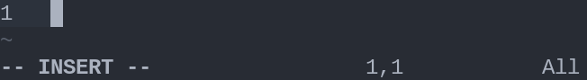
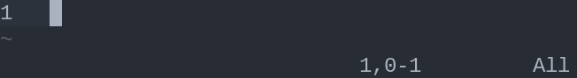
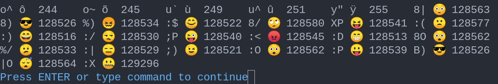
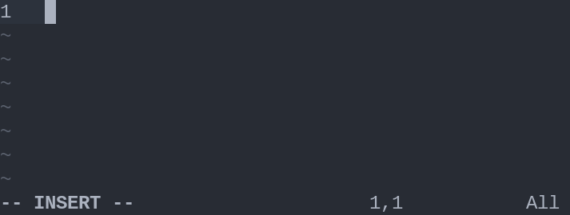
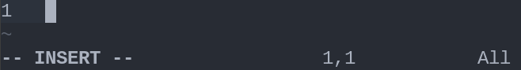

Emojis have become a ubiquitous part of the text we write. It doesn't matter if we're using a smartphone, your favorite social media app, or even the terminal, you're bound to find them everywhere and odds are also high for you wanting to use them in most writing contexts.

However, not all writing contexts make it as easy and intuitive to insert them into the text we're writing.

As a vimer, or just someone that doesn't consider himself a vimer but likes to tinker with the program, one of the writing contexts in which you may want to use emojis is obviously Vim.

In this tutorial you'll learn several ways to insert emojis in your text when writing with Vim, both making use of default Vim features and also using plugins if the defaults don't suite your needs.

## Using Vanilla Vim

There are three ways in which Vim allows you to enter emojis out of the box: inserting the raw Unicode point, using *Vim digraphs*, and using abbreviations.

That said, keep in mind that these features weren't specifically designed to insert emojis, so you'll probably need to configure a thing or two to smoothly integrate it to your regular workflow.

In the following subsections I'll go into more detail on how to use each of these features to insert emojis.

### Unicode Character Insertion

Since any emoji character is a Unicode character, any emoji can be inserted using the standard process to insert characters in Vim using the character's decimal, octal or hexadecimal representation:
1. Enter insert mode.
2. Hit `<C-V>` (<kbd>Ctrl</kbd> + <kbd>V</kbd>) and type the Unicode point corresponding to the character as follows:
   - `u` (lowercase) followed by the 4-digit hex (including leading zeroes) representing the character if the code lies in the range `0000` - `ffff`.
   - `U` (uppercase) followed by the 8-digit hex (including leading zeroes) representing the character if the code lies in the range `00000000` - `7fffffff`.

Notice that:
- Emojis whose character is represented by a point code lower than or equal to `ffff` can be represented either using an 8-digit hex or a 4-digit hex. For example, we could use either `<C-V>u2615` or `<C-V>U00002615` to get the *Hot beverage* emoji `☕`.

- Leading zeroes are optional, but we'll need to type a non-digit character to tell Vim that we finished typing the code. For instance, we could use `<C-V>U2615<Space>` instead of `<C-V>U00002615` to obtain `☕ `.
- `CTRL-V` is meant to help you insert *any* character except a line break, not just emojis. Refer to `:h i_CTRL-V_digit` for more information about it.

### Digraphs

Digraphs in Vim are simple mappings that can be used to insert a character using a two characters long alias for that character.

You can define custom digraphs using this syntax on your `.vimrc` file if you want to save the aliases:
```vi
digraph {two-character-alias} {character}
```
or using the same syntax in command mode if you only plan to use the digraph for the current Vim session.

To use the *digraphs*:
1. Enter insert mode.
2. Hit `<C-K>` and type the ***two char long*** alias that maps to the Unicode point of the character that you want ***in base 10***, e.g. if we define `digraph te 9749` we can get our beloved cup of tea using `<C-K>te` in insert mode (2615 in hexadecimal is 9749 in base 10).


Notice that:
- Again, this feature isn't meant only for emojis, you can use it for any character.
- Vim comes with a lot of digraph definitions, mostly commonly used special symbols such as ©, ®, or ¢. For the full list, enter `:digraph` in command mode.
- Some of the default digraphs are actually common emojis.


### Abbreviations

If you want to use something that doesn't require to enter a special sub-mode using `<C-something>`, then this is probably the emoji insertion method for you.

You can define abbreviations adding `ab {alias} {character(s)}` to your `./vimrc`, and then trigger them just by typing the abbreviated alias and hitting space afterwards, akin to tab expansion in other code editors.

Coming back to our beloved little cup, we'll insert it using abbreviations as follows:
1. Add `ab tea ☕` to your `./vimrc`.
2. Enter insert mode.
3. Type `tea ` and it gets automatically turned into `☕ `.

Notice that:
- You can also use `:ab {alias} {character(s)}` in command mode if you only intend to use the abbreviation for the current session.
- This feature is powerful! You can define whole snippets with it.
- Just like with the previous approach, manually defining a few abbreviations for a limited set of emojis is fine, but if you want every single emoji out there, then you may want to take a look at the plugins available.


## Using Plugins

There are more than enough emoji insertion plugins available for Vim 😄. Most of them use similar approaches, so, for the most part you'll be fine with any emoji plugin you choose.

There is one important difference in approach that you may want to take into consideration though: whether the plugin inserts the emoji character or it just inserts the common emoji alias (`:name_of_the_emoji:`) to be later rendered by a markup renderer or something similar.

Below you'll find detailed instructions on how to use two of the most popular emoji insertion plugins. One of them uses the character rendering approach and the other one uses alias completion without rendering the character.

### A Plugin that Completes the Alias and Does NOT Render the Emoji Character

The best option I found in this category was junegunn's [`vim-emoji`](https://github.com/junegunn/vim-emoji).

Installing this plugin is quite simple using `vim-plug`:
1. Add `Plug 'junegunn/vim-emoji'` to your `vim-plug` plugins in your `.vimrc`, source the file (`:so <path-to-your-vimrc>`), and run the installation command (`:PlugInstall`).
2. Set the user completion function in your `.vimrc` as follows, making sure to declare it *after* the `vim-plug` plugins block:
```vi
set completefunc=emoji#complete
```
3. Source your `.vimrc` again.

Once installed, all you need to do to complete emoji aliases is to access the `completefunc`tion using `<C-X>` to access completion mode and then `<C-U>` to use the custom completion function that you just set.



Notice that if you want to use something else for user completion (`<C-X><C-U>`), you'll need to write a tiny function that wraps `emoji#complete` and the extra logic that you want to use. Fortunately, writing this function is easy and the plugin's author explains how to do this in great detail [in this post](https://junegunn.kr/2014/06/emoji-completion-in-vim/).

#### Bonus

If you insert your emojis using aliases, but then you realize that your text renderer doesn't convert the aliases into images or if you just change your mind and want to have the characters instead of the aliases, you can use this substitution to turn all emoji aliases into emoji characters:
```vi
%s/:\([^:]\+\):/\=emoji#for(submatch(1), submatch(0))/g
```

### A Plugin that Completes the Alias and Renders the Emoji Character

If you're looking for an option that renders the actual emoji character instead of just the alias, gi1242's [`vim-emoji-ab`](https://gitlab.com/gi1242/vim-emoji-ab) can give you the behavior that you want.

#### Installation and Setup

You can install and set up this plugin using `vim-plug` as follows:
1. Add `Plug https://gitlab.com/gi1242/vim-emoji-ab.git` to the list of plugins in your `.vimrc` and source the file.
2. Run `:PlugInstall`.
3. Run `:runtime macros/emoji-ab.vim` if you only want to use the emoji completion in your current Vim session, or add it to your `.vimrc` if you want to have it available whenever you open a particular file type with Vim:
```vi
au FileType {filetypes} runtime macros/emoji-ab.vim
```

If you decide to enable this type of emoji completion modifying your `.vimrc`, keep in mind that:
- You can find more information about valid filetype slugs using `:h filetypes`. Some common values that may be handy for you are: `html`, `markdown`, `text`, and `gitcommit`.
- This plugin sets the *omni completion function* (the one used for `<C-V><C-O>`), so make sure that the filetypes that you choose don't have another `omnifunc`tion set for them.
- Remember to source `.vimrc` after every change.

#### Usage

As mentioned above, this plugin makes use of the `omnifunc`, so if you want to insert an emoji, all you need to do is to start typing the alias, then hit `<C-X>` to enter completion mode, then `<C-O>` for omni completion and finally just select the option that you want.


As a bonus, this plugin also allows you to convert common text smileys into their emoji equivalent either using Vim digraphs or abbreviations. The full list of emojis available through this method can be found in the [official documentation](https://gitlab.com/gi1242/vim-emoji-ab#smiley-style-abbreviations).




## Conclusion

Inserting emojis in Vim is easy, all you need to do is to pick the approach that better suits you, and you'll be able to use as many emojis as you want when writing using Vim.


## References

- [How do I enter an emoji into a string in Vim?](https://stackoverflow.com/questions/40262567/how-do-i-enter-an-emoji-into-a-string-in-vim) on StackOverflow.
- [Unicode Planes](https://en.wikipedia.org/wiki/Plane_(Unicode)) on Wikipedia.
- [How to Insert Unicode Characters in Neovim/Vim](https://jdhao.github.io/2020/10/07/nvim_insert_unicode_char/) by jdhao.
- [Emoji completion in Vim](https://junegunn.kr/2014/06/emoji-completion-in-vim/) by junegunn.
