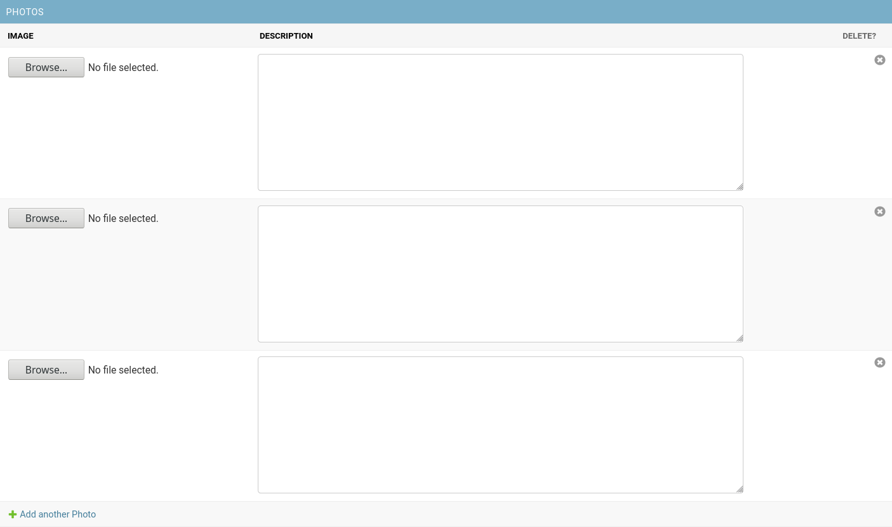
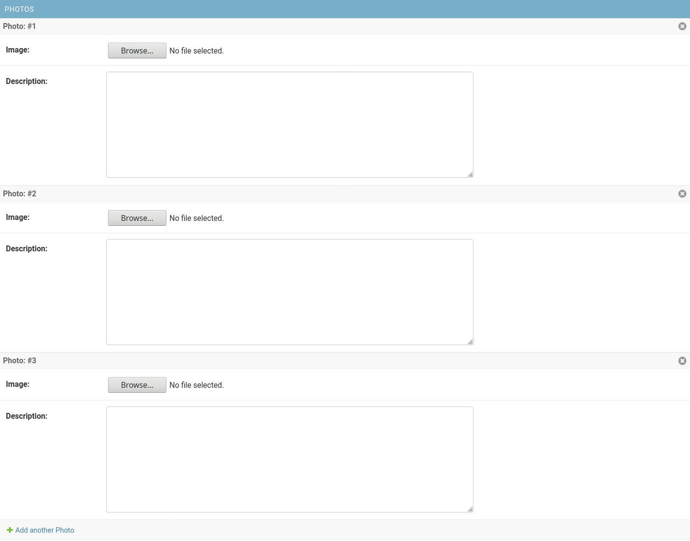
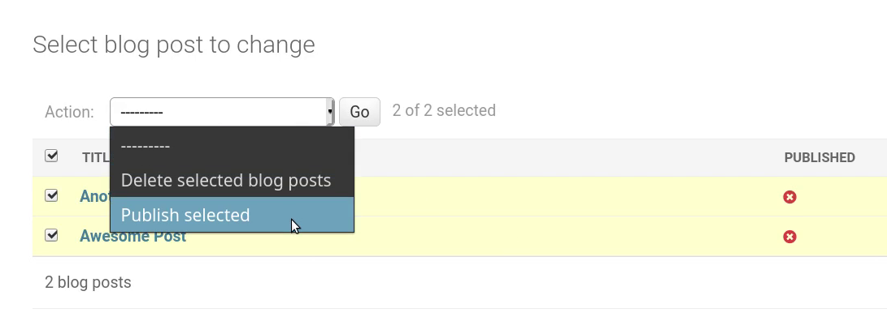

Django is one of the most popular web frameworks, it has been around for more than a decade and among its many distinctive features is the prebuilt administration dashboard that comes with it.

## What the Django Admin Is

The Django admin is simply a Django app (a module that allows you to do a especific set of tasks using Django) that provides you with a simple interface to perform CRUD operations on the models that are configured to be shown in the admin website.

It is meant to be a simple way to manage the model instances of your project without the need to spend extra time developing a custom UI to be able to do so.

However, it does provide the developer with a lot of customization options that offer features such as custom permissions, custom form validation and even support for using custom templates for the admin interface.

## What the Django Admin Is Not

Even though, the Django Admin supports a lot of customization, as a rule of thumb, if you are planing to create a dashboard to visualize your data in a way that differs a lot from the original design of the Django admin templates, then chances are that you'd be better off creating your own admin panel from scratch, with an arquitecture tailored to your specific needs.

Keep in mind that Django Admin is meant to provide you a basic visual interface to manage your model instances *whithout* having to spend too much time on creating the interface, therefore, expending too much time customizing the admin defeats the initial purpose of this Django app.

## Basic Setup

The Django admin comes installed by default when initializing your project using the `startproject` command. All you need to enter the interface is to start the server, go to `/admin/` and log in with an admin user (use the `createsuperuser` command to create a user with admin permissions if you don't have one already).

If for some reason you didn't initialize your project using the `starproject` command and you need to set up the Django admin manually, all you need to do is to make sure that the needed apps are listed in `INSTALLED_APPS` and the `TEMPLATES` setting is configured [as described in the official docs](https://docs.djangoproject.com/en/dev/ref/contrib/admin/#overview).

## Architectural Overview

The focus of this section is not to understand the inner workings of the Django admin but rather to explain the main architectural patterns that you'll need to understand as a developer using the Django admin app.

There are three main classes and one function that represent the core of the Django admin architecture, namely: the classes `django.contrib.admin.ModelAdmin`, `django.contrib.admin.InlineModelAdmin`, and `django.contrib.admin.AdminSite` and the function `admin.site.register()`.

### `register()`

If the default Django admin interface fulfills all your needs, all you need to do to be able to add a specific Model to the admin is to register your model using `django.contrib.admin.site.register()` as follows:

```python
# myapp/admin.py
from django.contrib import admin

from myproject.myapp.models import MyModel


admin.site.register(MyModel)
```

### `ModelAdmin`

`ModelAdmin` is a class that contains all the information needed to define the specifics of the interface used to handle a particular model.

This is the class that allows you to define custom permissions, and any big or small UI modifications for the admin interface used for a particular model.

You associate a particular model with a specific `ModelAdmin` as follows:
```python
# myapp/admin.py
from django.contrib import admin

from myproject.myapp.models import MyModel


class MyModelAdmin(admin.ModelAdmin):
    pass


admin.site.register(MyModel, MyModelAdmin)
```

Alternatively, you can associate the model with its `ModelAdmin` using the `register()` decorator:
```python
# myapp/admin.py
from django.contrib import admin

from myproject.myapp.models import MyModel


@admin.register(MyModel)
class MyModelAdmin(admin.ModelAdmin):
    pass
```

### `InlineModelAdmin`

It is very common to have models associated with other models, for example, a `Photo` model can be associated with an `Author` model, and you could register both `Photo`, and `Author` to the admin, which will result in having separate admin interfaces to manage the objects of each type.

However, you may want to be able to edit the information of the photos created by a particular author without having to leave the author page. For this and similar cases, we use the `InlineModelAdmin` class to describe how the related model interface will be shown inside the admin interface of the parent model.

`InlineModelAdmin` is never used directly, but rather through the subclasses `TabularInline` and `StackedInline`. These two classes have the same exact attributes and methods, save for the template they use to display the inline form.

This is how you'd use `TabularInline` for example:
```python
# photos/admin.py
from django.contrib import admin

from myproject.photos.models import Author, Photo


class PhotoInline(admin.TabularInline):
    model = Photo


@admin.register(Author)
class AuthorAdmin(admin.ModelAdmin):
    inlines = [PhotoInline] # assuming that there's a FK to Author in Photo
```
resulting in a "tabular" inline form:



Substituting `TabularInline` by `StackedInline` results in a "stacked" inline form:



### `AdminSite`

Each Django admin site is represented by an `AdminSite` class. In most cases, you don't have to use this class, however, if you happen to want to edit aspects of the admin site that are not associated with a particular model but rather are more general in nature, this is the class that allows you to perform those customizations.

## How to Customize the Django Admin

Even though the Django admin is a full-fledged application with a default configuration that suits general needs, chances are that you may want to tweak the default interface a little bit to better suit the particular needs of your project.

For example, you may want to customize the default values to be able to:
- Filter the listed objects depending on a specific set of conditions.
- Display only the main attributes of a model instead of displaying all attributes.
- Create handy utilities to edit batches of objects instead of editing each object individually.

The Django admin allows you to perform all of the customizations mentioned in the examples and much more with only minor tweaks to the default values.

In the following sections we'll go into more detail on which class methods and attributes are used for customizing the admin.

### Basic UI Customization

Django admin allows you to perform simple UI changes such as specifying what attributes to display and what filtering to use without having to write too much code.

Below is a list of the most useful methods and attributes available to perform this type of tasks on pages:

- `ModelAdmin.get_queryset()`: override this method to filter the objects that you want to display in the admin. For example, if we have a system for a blog or a similar publication we may want to only allow authors to see the articles that they've written. We can fulfill this requirement using something like this:

```python
# myapp/admin.py
from django.contrib import admin

from myproject.myapp.models import BlogPost


@admin.register(BlogPost)
class BlogPostAdmin(admin.ModelAdmin):
    def get_queryset(self, request):
        return super().get_queryset().filter(author=request.user)
```

- `ModelAdmin.exclude` / `ModelAdmin.get_exclude(request, object=None)`: set the attribute to a list containing the names of the fields you don't want to display in the change and add pages. Alternativelly, you can determine this list programatically using the method version.
- `ModelAdmin.fields` / `ModelAdmin.get_fields(request, object=None)`: set the attribute to a list with the names of the fields you want to display in the change and add pages. Alternativelly, you can determine the value using the method version.
- `ModelAdmin.inlines` / `ModelAdmin.get_inlines(request, object)`: this attribute needs to be set with a list containing the inline classes you want to include in the admin interface of the parent model. Since Django 3.0, you can also use the method version to determine the list of inlines programatically.
- `ModelAdmin.list_display` / `ModelAdmin.get_list_display(request)`: this pair is the equivalent of `fields` / `get_fields()` for the change list page.
- `ModelAdmin.list_display_links` / `ModelAdmin.get_list_display_links(request, list_display)`: set the attribute to a list containing the names of the fields that should link to the change page. Use the method version to determine this list programatically.
- `ModelAdmin.list_editable`: set it to a list with the names of the fields you'd like to edit directly in the change list page.
- `InlineModelAdmin.readonly_fields`: set it to a list containing the names of the fields you don't want to be editable in the add and change pages.
- `ModelAdmin.sortable_by` / `ModelAdmin.get_sortable_by(request)`: set the attribute to a list containing the names of the fields that will allow sorting in the change list page.

Inlines also offer a similar set of attributes to perform basic UI customization:

- `InlineModelAdmin.exclude`: use it exactly as the `ModelAdmin` attribute.
- `InlineModelAdmin.fields`: Ídem.
- `InlineModelAdmin.readonly_fields`: Ídem.

### Advanced UI Customization

If you want to apply custom Django templates to the admin, you can do so by overriding the following properties depending on the page you'd like to customize:

- `ModelAdmin.change_list_template`: set this attribute to the path to a custom template to be used for the change list page (`changelist_view()`).
- `ModelAdmin.add_form_template`: set this attribute to the path to a custom template to be used for the add page (`add_view()`).
- `ModelAdmin.change_form_template`: set this attribute to the path to a custom template to be used for the change page (`change_view()`).
- `ModelAdmin.delete_confirmation_template`: set it to a path to a custom template to be used by `delete_view()` as a delete confirmation page.
- `ModelAdmin.delete_selected_confirmation_template`: set it to a path to a custom template to be used by the `delete_selected` action method --see next section to learn more about actions-- as a delete confirmation page.
- `ModelAdmin.object_history_template`: set it to a path to a custom template to be used by `history_view()`.
- `ModelAdmin.popup_response_template`: set it to a path to a custom template to be used by `response_add()`, `response_change()` and `response_delete()`.

## Actions

Actions are functions that allow you to perform a task on several objects. By default, Django admin comes with the delete action, but it also allows you to create your own actions.

For instance, say that you have a `BlogPost` that has a boolean field that determines whether or not it is published and you have several post drafts you want to mark as published. You could change the `published` values of each object one by one, or you could create an action that allows you to batch edit the posts just as follows:

```python
# myapp/admin.py
from django.contrib import admin

from myproject.myapp.models import BlogPost


# Define a function that takes the current ModelAdmin, the HTTPRequest
# that triggers the action and the QuerySet containing the objects
# selected by the user as parameters.
def publish_selected(modeladmin, request, queryset):
    queryset.update(published=True)

# Add a description that will be used to identify the action in the
# action dropdown widget
publish_selected.short_description = 'Publish selected'

@admin.register(BlogPost)
class BlogPostAdmin(admin.ModelAdmin):
    list_display = ['title', 'published']
    actions = [publish_selected] # Register the action
```


## Conclusion

We've seen what the Django admin is, when to use it and how to perform handy customizations to its interface.

You should be able to use the Django admin with confidence with this essential knowledge, however, it is also recommended to take a look at the [official docs](https://docs.djangoproject.com/en/dev/ref/contrib/admin/#module-django.contrib.admin) if you happen to want to go deeper into the topic.

Happy coding! 😊.
